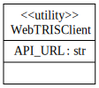
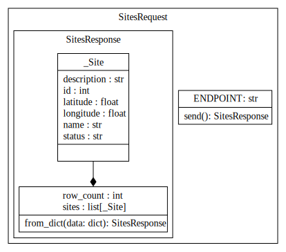
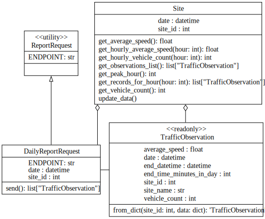

This report provides more in-depth explanations and justifications of decisions made when designing and implementing the code contained in this project, AE2. UML-style diagrams based on UML 2.5.1 are included and are intended to demonstrate class structure in a visual manner.
# WebTRISClient Class
 <br>
The WebTRISClient stands alone as a solely abstract class with one attribute: `API_URL`. This class originally hosted more classes, such as the deprecated `WebTRISFetchError` exception, which was removed in favor of standard exceptions raised by `request.raise_for_status()`. Using standard exceptions allows clients to catch errors in a more predictable manner without needing to familiarize themselves with custom exceptions. 

# Sites Endpoint
## Class layout

## SitesRequest
SitesRequest is a class meant to request data from the WebTRIS API as appropriate. If a user wanted to use coordinates in an application to find the nearest active traffic camera, they would be able to first query all of the traffic cameras and then filter through them. In an application, the user is meant to instantiate a `SitesRequest` and then call its `.send()` method to receive data in the form of a `SitesResponse`. The `SitesRequest` object does not take any initialization arguments as the API takes no parameters other than version. A sample request may look like:
```Python 3
req = SitesReqest()
data = req.send()
```

## SitesRequest.SitesResponse
Modeled after the structure of the actual response that the WebTRIS API gives, `SitesResponse` is meant to provide a list of sites from the sites endpoint so the user can make a choice of which site to gather traffic observations from. `SitesResponse` is nested within `SitesRequest` as it is not meant to be instantiated outside of `SitesRequest` or any relevant tests. (Not meant to be interacted with by the user). This is because all data should exclusively be returned by the API and as such is set to be read-only. Using this nested structure is also important as this code is acting as a library and reducing the number of exposed components is beneficial to directing users of this code. `SitesResponse` is primarily composed of its `.from_dict()` class method, which takes in raw API data and returns proper structures.

>**Note:**  If the data used in `.from_dict()` is missing fields, has empty descriptions, coordinates, or status, it will be excluded from the return value and a message will be printed to the console. The rationale behind this decision is that the client applications are likely to use all of the fields of a site, including location, id, and status. If `None` values were included, a user may try to query an incomplete record in the API. Name was originally intended to be part of this set, but many valid records do not include a `"Name"` field yet still have otherwise queryable data. 

An example usage of `SitesResponse` may be as follows
```Python 3
SitesRequest.send(...) -> SitesResponses:
...
data = response.json()
sites_response = SitesResponse.from_dict(data)
return sites_response
```
## SitesRequest.SitesResponse.\_Site
 The `_Site` class is a small dataclass which holds an id, name, description, longitude, latitude, status. While this could be held in a `dict[str, any]`, forcing keys and value types provides stronger reliability of the class. The lack of methods and `__init__()` leads it to be a protected, nested method. Users should not be instantiating this class themselves. Mostly, this class serves to provide type hints to users.  

# Reports Endpoint
## Class Layout


## ReportRequest
This class is not meant to be instantiated. It only contains the static `ENDPOINT` attribute for report requests. `ReportRequest` is intended to be inherited from so that future implementations can provide generalization for `ReportRequest`s as there are unimplemented monthly and annual options. Potential usage as a parent class:
```Python 3
class DailyReportRequest(ReportRequest):
...
```

## DailyReportRequest
The `DailyReportRequest` class is where users make a request to the endpoint for daily data in fifteen minute intervals on traffic cameras. Users may instantiate these requests themselves, though are recommended to instead use the `Site` class instead, which has methods to access this class. `DailyReportRequest` needs a `site_id` and `date` upon initialization so it can query data from the API relevant to the dates. Its main body is in the `.send()` method. If any data is found to be faulty (excluding unnecessary fields), it is excluded from the return list. Even if one entry is faulty, others may be good and all good data should be returned, but errors should not stop the application entirely. While using `None` to fill empty data was considered, predicted use cases for this codebase usually use multiple pieces of data from each request. Having data potentially riddled with `None` types would make any implementation full of individual `is None` checks, whereas excluding data before returning it means that implementations can be much cleaner and rely on data integrity.
```Python 3
req = DailyReportRequest(site_id, date)
observations: FifteenMinuteObservation = req.send()
```

## FifteenMinuteObservation
`FifteenMinuteObservation` is primarily the return of `DailyReportRequest.send()` and is not meant to be instantiated by the user. When initialized, it validates data and raises `ValueError` and `TypeError` if fields are not properly initialized. It refuses to store faulty/empty values on fields `site_name`, `site_id`, `observation_end_datetime`, `average_speed`, and `vehicle_count`. The rationale justifying this implementation is that observations are intended to be used to compare data in multiple sectors. Calculating an average speed for the day, for example, requires vehicle counts to weight the fifteen minute average speeds properly. While it could have been nested in `DailyReportRequest`, `FifteenMinuteObservation` may directly be stored in a list and operated on in other places, such as a `Site`. Example usage:
```Python 3
req = DailyReportRequest(site_id, date)
observations = req.send()
for o in observations:
	print(f"Avg speed for time {o.end_datetime.strftime('%H:%M:%S')}: {o.average_speed}")
```

# Single Site Representation
## Site
A class representing one site's observations for a given date. Takes `date` and `site_id` arguments and queries API on initialization and upon updating date. `Site` also refreshes its internal data when `date` is updated, to guarantee that its data is always in sync with its attributes (`site_id` is read-only to encourage the pattern of a `Site` representing only one site). This class is the primary outward-facing class intended for users to use. Provides many helper methods to operating on its internal list of `FifteenMinuteObservations`. Data can be queried by multiple methods in the class to draw conclusions from the observations. Example usage:
```Python 3
site = Site(site_id=site_id, date=date)
print(f"Site Name: {site.name or 'Unknown Name'}")
print(f"Average Speed: {site.get_average_speed()} mph")
print(f"Vehicle Count: {site.get_vehicle_count()}")
```

# Example Program
Below (main.py) is an example use program which asks the users for coordinates, gets the nearest traffic camera, then prints some data on it.
```Python 3
from datetime import datetime
from webtris_client import WebTRISClient, Site, FifteenMinuteObservation, DailyReportRequest, SitesRequest

if __name__ == "__main__":
    # Ask for coordinates and date
    latitude = input("Enter the latitude: ")
    try:
        float(latitude)
    except ValueError:
        print("Invalid latitude. Please enter a valid number.")
        exit(1)
    longitude = input("Enter the longitude: ")
    try:
        float(longitude)
    except ValueError:
        print("Invalid longitude. Please enter a valid number.")
        exit(1)
    date_str = input("Enter the date (YYYY-MM-DD): ")
    try:
        date = datetime.strptime(date_str, "%Y-%m-%d")
    except ValueError:
        print("Invalid date format. Please enter the date in YYYY-MM-DD format.")
        exit(1)
        
    # Get the site id closest to the coordinates
    sites = SitesRequest().send()
    closest_site = min(sites.sites, key=lambda site: (site.latitude - float(latitude))**2 + (site.longitude - float(longitude))**2)
    site_id = closest_site.id
    print(f"Closest site ID: {site_id}")
        
    # Get the traffic data for the site and date
    site = Site(site_id=site_id, date=date)
    print(f"Site Name: {site.name or 'Unknown Name'}")
    print(f"Average Speed: {site.get_average_speed()} mph")
    print(f"Vehicle Count: {site.get_vehicle_count()}")
    peak_hour = site.get_peak_hour()
    print(f"Peak Hour: {peak_hour} ({site.get_hourly_vehicle_count(peak_hour)} vehicles)")
    
    """
    Example usage:
    Enter the latitude: 51.4087721045577
    Enter the longitude: 0.381354080809833
    Enter the date (YYYY-MM-DD): 2025-03-10
    
    Closest site ID: 14
    Site Name: A2/8392M
    Average Speed: 42.467943045611776 mph
    Vehicle Count: 12431
    Peak Hour: 8 (1094 vehicles)
    """
```